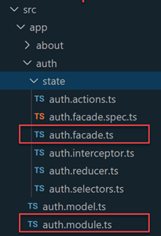

# Using Microsoft Authentication Library - MSAL and NgRx

[Food App](https://github.com/arambazamba/food-app)

- .NET 6 Api 
- Angular 13 UI using NgRx 

[Microsoft identity platform documentation](https://docs.microsoft.com/en-us/azure/active-directory/develop/)

[MSAL Auth Flows](https://docs.microsoft.com/en-us/azure/active-directory/develop/msal-authentication-flows)

[.NET Core Authentication Snippets](https://docs.microsoft.com/en-us/aspnet/core/security/authentication/social/microsoft-logins?view=aspnetcore-6.0)

## Demo

- Requirements
- Create 2 App Registrations
- Configure Angular MSAL Auth
- Configure Api MSAL

### Requirements

- [Azure Trial Account](https://azure.microsoft.com/en-us/free/)

- [Azure CLI](https://docs.microsoft.com/en-us/cli/azure/install-azure-cli?view=azure-cli-latest)

- [Getting Started with Azure CLI](https://github.com/arambazamba/ng-adv/tree/feature/msal-auth/Tooling/04-CLI)

    > Note: For Visual Studio Code integration install [Azure CLI Tools](https://marketplace.visualstudio.com/items?itemName=ms-vscode.azurecli) and [Azure Account](https://marketplace.visualstudio.com/items?itemName=ms-vscode.azure-account)

### Create 2 App Registrations

Execute `create-msal-app-reg.azcli`.

Check AppRegistration:


### Configure Angular MSAL Auth

`package.json`:

```
"@azure/msal-angular": "^2.0.6",
"@azure/msal-browser": "^2.20.0",
```

Most of the msal activity is implemented in `auth.facade.ts` and `auth.module.ts`. `auth.module.ts` is imported into `app.module.ts`



`auth.module.ts`:

```typescript
@NgModule({
  declarations: [],
  imports: [
    CommonModule,
    HttpClientModule,
    MsalModule,
    StoreModule.forFeature(authFeatureKey, authReducer),
  ],
  providers: [
    MsalAuthFacade,
    {
      provide: HTTP_INTERCEPTORS,
      useClass: MsalInterceptor,
      multi: true,
    },
    {
      provide: MSAL_INSTANCE,
      useFactory: MSALInstanceFactory,
    },
    {
      provide: MSAL_GUARD_CONFIG,
      useFactory: MSALGuardConfigFactory,
    },
    {
      provide: MSAL_INTERCEPTOR_CONFIG,
      useFactory: MSALInterceptorConfigFactory,
    },
    MsalService,
    MsalGuard,
    MsalBroadcastService,
  ],
})
export class MsalAuthUtilModule {}
```

`auth.facade.ts`:

```typescript
@Injectable()
export class MsalAuthFacade {
  constructor(
    @Inject(forwardRef(() => ConfigService)) private cs: ConfigService,
    private msalBC: MsalBroadcastService,
    private store: Store<MsalAuthState>
  ) {
    this.handleLoginSuccess(this.msalBC);
  }

  getAuthState() {...
   
  getUser() {...

  isInitAndAuthenticated() {...

  handleLoginSuccess = (broadcast: MsalBroadcastService) => {...

  logout() {...
}

// factories used in module
export function MSALInstanceFactory(): IPublicClientApplication {
  let config = {
    auth: {
      clientId: 'd23642f7-...',
      authority: 'https://login.microsoftonline.com/d92b247e-...',
      redirectUri: '/',
    },
    ...
  };
  return new PublicClientApplication(config);
}

export function MSALInterceptorConfigFactory(): MsalInterceptorConfiguration {
  const protectedResourceMap = new Map<string, Array<string>>();
  protectedResourceMap.set('https://graph.microsoft.com/v1.0/me', ['user.read',]);
  protectedResourceMap.set('https://localhost:5001/food', ['api://b509d389-.../access_as_user',]);
  return {interactionType: InteractionType.Redirect, protectedResourceMap,};
}
...
```
### Configure .NET Api MSAL Auth

`appsettings.json`:

```json
{
  "AzureAd": {
      "TenantId": "d92b247e-...",
      "ClientId": "b509d389-...",
      "Instance": "https://login.microsoftonline.com/",
      "cacheLocation": "localStorage",
  },
```

`Startup.cs`:

```c#
public void ConfigureServices(IServiceCollection services)

  services.AddAuthentication(JwtBearerDefaults.AuthenticationScheme)
      .AddMicrosoftIdentityWebApi(Configuration)
      .EnableTokenAcquisitionToCallDownstreamApi()
      .AddInMemoryTokenCaches();

  services.AddAuthorization();
```

```c#
public void Configure(IApplicationBuilder app, IWebHostEnvironment env)

  app.UseCors("default");
  app.UseHttpsRedirection();
  app.UseRouting();
  app.UseAuthentication();
  app.UseAuthorization();
```

`FoodController.cs`:

```c#
[Authorize]
[Route ("[controller]")]
[ApiController]
public class FoodController : ControllerBase {

  static readonly string[] scopeRequiredByApi = new string[] { "access_as_user" };

  [HttpGet ()]
  public IEnumerable<FoodItem> GetFood () {
      HttpContext.VerifyUserHasAnyAcceptedScope(scopeRequiredByApi);
      return ctx.Food.ToArray ();
  }
```