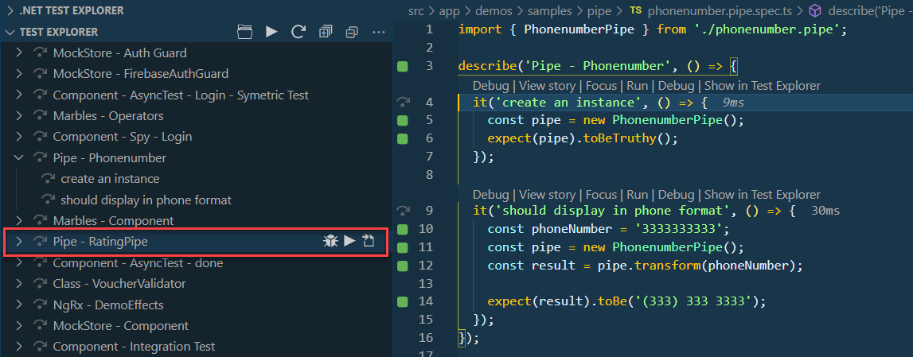
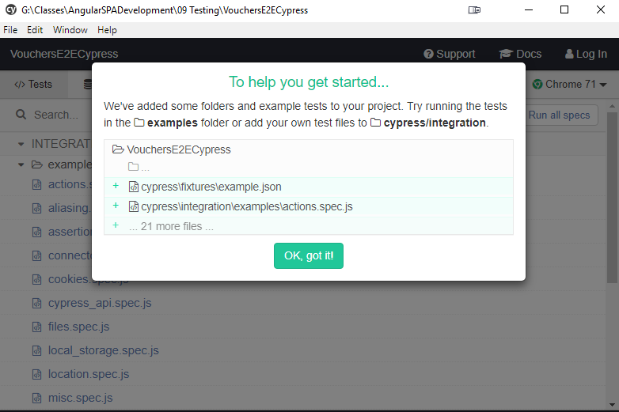

# Advanced Testing

> Note: Sometimes you want to move your Test Data to an extermal JSON file and the you'll notice that it's not a valid JSON file concerning double quotes. This is when [Fix JSON](https://marketplace.visualstudio.com/items?itemName=oliversturm.fix-json) comes to the rescue!

## TestExplorer

[Test Explorer UI](https://marketplace.visualstudio.com/items?itemName=hbenl.vscode-test-explorer)

[Test Explorer Status Bar](https://marketplace.visualstudio.com/items?itemName=connorshea.vscode-test-explorer-status-bar)



## Jasmine

[Jasmine Matchers](https://jasmine.github.io/api/edge/matchers.html)

## Wallaby

[Wallaby VS Code Extension](https://marketplace.visualstudio.com/items?itemName=WallabyJs.wallaby-vscode)

[Free Trial Licence](https://wallabyjs.com/download/)

Enter Licence Key: F1 -> Wallaby.js: Manage Licence Key

Start Testing: F1 -> Wallaby.js: Start

[Wallaby Angular Setup](https://wallabyjs.com/docs/tutorial/angular-cli.html)

## Jest

[JestVS Code Extension](https://marketplace.visualstudio.com/items?itemName=Orta.vscode-jest)

[Jest Testing](https://jestjs.io/)

### Jest Installation

Three ways to install Jest:

- Manual - described below
- Using [Schematics](https://github.com/briebug/jest-schematic)
- Using Nrwl Nx (https://nx.dev/angular)

#### Manual Jest installation

Remove Karma Libs:

```
npm remove karma karma-chrome-launcher karma-coverage-istanbul-reporter karma-jasmine karma-jasmine-html-reporter
```

Remove Karma files: `./karma.conf.js` `./src/test.ts`

Install Jest:

Install `@angular-builders/jest` and `jest`:

```
npm i -D jest @types/jest @angular-builders/jest
```

Install core-js:

```
npm i core-js -D
```

Update your Typescript configurations:

- Remove `test.ts` from files array

  > This file was responsible for Karma setup, you don’t need it here anymore

- Replace jasmine in types array of `tsconfig.spec.json` with jest

  > You want your tests to be type-checked against Jest typings and not Jasmine

```
{
  "extends": "./tsconfig.json",
  "compilerOptions": {
    "outDir": "./out-tsc/spec",
    "types": ["jest", "node"]
  },
  "files": ["src/polyfills.ts"],
  "include": ["src/**/*.spec.ts", "src/**/*.d.ts"]
}
```

- Add `jest` to types array in `tsconfig.json` & add `"esModuleInterop": true`

```
{
  "compileOnSave": false,
  "compilerOptions": {
    "baseUrl": "./",
    "outDir": "./dist/out-tsc",
    "sourceMap": true,
    "declaration": false,
    "module": "esnext",
    "moduleResolution": "node",
    "emitDecoratorMetadata": true,
    "experimentalDecorators": true,
    "esModuleInterop": true,
    "importHelpers": true,
    "target": "es2015",
    "typeRoots": ["node_modules/@types"],
    "lib": ["es2017", "es2018", "dom", "esnext"],
    "types": ["jest"]
  }
}

```

Update `angular.json`:

```
  "test": {
          "builder": "@angular-builders/jest:run",
          "options": {
            "no-cache": true,
            "main": "src/test.ts",
            "polyfills": "src/polyfills.ts",
            "tsConfig": "tsconfig.spec.json",
            "assets": ["src/favicon.ico", "src/assets"],
            "styles": ["src/styles.scss"],
            "scripts": []
          }
        },
```

Run Tests:

```
ng test
```

[Spectator - A Powerful Tool to Simplify Your Angular Tests](https://github.com/ngneat/spectator)

### Marble Testing

Installation:

```
npm i jasmine-marbles
```

> Note: [rxjs-marbles](https://github.com/cartant/rxjs-marbles) is an alternative to jasmine-marbles

# Cypress E2E Testing

[Cypress Docs](https://docs.cypress.io/guides/overview/why-cypress.html#In-a-nutshell)

[Cypress Angular Schematic](https://github.com/briebug/cypress-schematic)

```
ng add @briebug/cypress-schematic
```

## Cypress Manual Setup

Install packages: `npm i --save-dev cypress chance`

Modify `package.json` and run using `npm run e2e`

```
"scripts": {
    "ng": "ng",
    "start": "ng serve",
    "build": "ng build",
    "test": "ng test",
    "lint": "ng lint",
    "cypress": "cypress open"
  },
```

Examine sample tests in `/cypress/integration/examples`:

> Note: You can also use [Cypress Angular Schematic](https://github.com/briebug/cypress-schematic) to install Cypress. It saves you from removing Protractor

## Starting Cypress

Execute: `npm run cypress`

When running for the first time

- cypress is installed,
- a popup is shown
- the cypress folder in the project is created




## Write a Test

[Writing your first test](https://docs.cypress.io/guides/getting-started/writing-your-first-test.html)

- Start your App using `ng serve`

- Create a new file "vouchers.spec.js" in `/cypress/integration/`

- Add a reference to cypress to the top of the page

```
/// <reference types="Cypress" />
```

- Add the following structure to the file below the import

```
context('Demos', () => {
	beforeEach(() => {
		cy.visit('http://localhost:4200/demos');
	});

  //Add test here later

});
```
