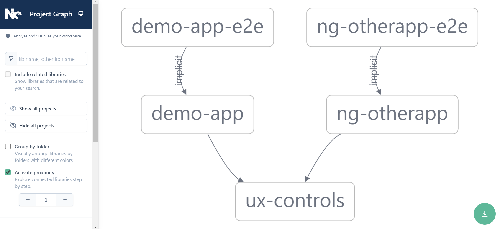

# Monorepos & nrwl nx

[Nx Home](https://nx.dev/angular)

[npx create-nx-workspace](https://nx.dev/nx/create-nx-workspace)

[Angular Nx Tutorial ](https://nx.dev/getting-started/angular-tutorial)

[Nx Console - VS Code Extension](https://marketplace.visualstudio.com/items?itemName=nrwl.angular-console)

## Getting Started

Create a workspace demo-app, add Angular:

```typescript
npx create-nx-workspace demo-app-ws --preset angular --appName demo-app
```


Build the app `ng-skills`:

```
ng build ng-skills |
nx build ng-skills
```

> Note: `nx builds ng-skills` uses cache and builds only when there are changes

Test the app using Jest (default)

```
nx test ng-skills
```

Run the app:

```
nx s -o ng-skills
```

## Button Implementation

Add a lib project and a button and a split component to it:

```typescript
ng g @nrwl/angular:lib ux-controls --style=sass
ng g component ux-button --project=ux-controls --export --selector=ux-button
ng g component ux-split --project=ux-controls --export --selector=ux-split
```

Add a second app used for dependency graph later on:

```
nx generate @nrwl/angular:app ng-otherapp --routing --style=scss
```

Add Material to nx workspace:

```
npm install -S @angular/material @angular/cdk @angular/flex-layout @angular/animations
```

Add Material to apps\ng-skills & apps\ng-otherapp

```
ng add @angular/material --project=ng-skills
ng add @angular/material --project=ng-otherapp
```

Implement the Material Module in the lib

```
nx g module material --project=ux-controls
```

```
import { NgModule } from '@angular/core';
import { CommonModule } from '@angular/common';
import { MatButtonModule } from '@angular/material/button';
import { MatIconModule } from '@angular/material/icon';
import { FlexLayoutModule } from '@angular/flex-layout';

@NgModule({
  declarations: [],
  imports: [CommonModule, MatButtonModule, MatIconModule, FlexLayoutModule],
  exports: [MatButtonModule, MatIconModule, FlexLayoutModule],
})
export class MaterialModule {}

```

> Note: Just copy the content of a Material Module from any [Material Stackblitz Sample](https://material.angular.io/components/categories)

Add the Material Module to `ux-controls.module.ts`:

```
import { NgModule } from '@angular/core';
import { CommonModule } from '@angular/common';
import { UxButtonComponent } from './ux-button/ux-button.component';
import { UxSplitComponent } from './ux-split/ux-split.component';
import { MaterialModule } from './material/material.module';

@NgModule({
  imports: [CommonModule, MaterialModule],
  declarations: [UxButtonComponent, UxSplitComponent],
  exports: [UxSplitComponent],
})
export class UxControlsModule {}
```

Implement the Button:

ux-button.ts & ux-button.html

```typescript
import { Component, OnInit, EventEmitter, Input, Output } from '@angular/core';

@Component({
  // eslint-disable-next-line @angular-eslint/component-selector
  selector: 'ux-button',
  templateUrl: './ux-button.component.html',
  styleUrls: ['./ux-button.component.scss'],
})
export class UxButtonComponent implements OnInit {
  @Input() disabled = false;
  @Input() label = '';
  @Input() icon = '';
  // eslint-disable-next-line @angular-eslint/no-output-on-prefix
  @Output() onClick: EventEmitter<void> = new EventEmitter();

  // eslint-disable-next-line @typescript-eslint/no-empty-function
  constructor() {}

  ngOnInit() {
    this.icon = '';
  }

  buttonClicked() {
    this.onClick.emit();
  }
}
```

```html
<button mat-raised-button (click)="buttonClicked()" [disabled]="disabled">
  <mat-icon>{{ icon }}</mat-icon>
  <span fxHide.lt-lg>{{ label }}</span>
</button>
```

Export the button:

```typescript
import { NgModule } from '@angular/core';
import { CommonModule } from '@angular/common';
import { UxButtonComponent } from './ux-button/ux-button.component';
import { UxSplitComponent } from './ux-split/ux-split.component';
import { MaterialModule } from './material/material.module';

@NgModule({
  imports: [CommonModule, MaterialModule],
  declarations: [UxButtonComponent, UxSplitComponent],
  exports: [UxSplitComponent, UxButtonComponent],
})
export class UxControlsModule {}
```

Use the Button in the two projects:

```typescript
import { BrowserModule } from '@angular/platform-browser';
import { NgModule } from '@angular/core';

import { AppComponent } from './app.component';
import { BrowserAnimationsModule } from '@angular/platform-browser/animations';
import { UxControlsModule } from '@angular-repo/ux-controls';

@NgModule({
  declarations: [AppComponent],
  imports: [BrowserModule, BrowserAnimationsModule, UxControlsModule],
  providers: [],
  bootstrap: [AppComponent],
})
export class AppModule {}
```

Add it to App Component

```html
<div>
  <h3>{{title}}</h3>
  <ux-button
    [icon]="'bug_report'"
    [label]="'Report Bug'"
    (onClick)="doClick()"
  ></ux-button>
</div>
```

```typescript
import { Component } from '@angular/core';

@Component({
  selector: 'angular-repo-root',
  templateUrl: './app.component.html',
  styleUrls: ['./app.component.scss'],
})
export class AppComponent {
  title = 'ng-skills';

  doClick() {
    console.log('you clicked');
  }
}
```

Test the Button:

```
nx s -o ng-skills
```

> Note: repate the steps in the second project

Show Dependency Graph

```
nx dep-graph
```

You should see something similar:



## Starting with an Empty project:

```typescript
npx create-nx-workspace EmptyRepo --preset=empty
cd empty-repo
npm install --save-dev @nrwl/angular
nx generate @nrwl/angular:app skills-app --e2e-test-runner=cypress --unit-test-runner=jest --style=sass
```

Add two projects:

```typescript
ng g @nrwl/angular:app ng-skills --e2e-test-runner=cypress --unit-test-runner=jest --style=sass
ng g @nrwl/angular:app ng-other
```
