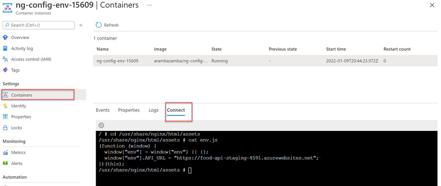

# Container

Use `arambazamba/ng-config-env`-image created earlier this module.

## Demos

- Docker Basics
- Explain multistage build of `food-ui` publish to DockerHub
- Introduction to Azure Container Instances (ACI)
- Host on Azure Container Instances (ACI) with injected config

### Multistage build of `ng-config-env` publish to DockerHub

Explain section in `dockerfile`:

```
CMD ["/bin/sh",  "-c",  "envsubst < /usr/share/nginx/html/assets/env.transform.js > /usr/share/nginx/html/assets/env.js && exec nginx -g 'daemon off;'"]
```

### Host on Azure Container Instances (ACI) with injected config

Execute `create-container-instance.azcli`:

```
rnd=$RANDOM
grp=ng-adv-$rnd
loc=westeurope
app=ng-config-env-$rnd
img="arambazamba/ng-config-env"

az group create -n $grp -l $loc

az container create -g $grp -l $loc -n $app --image $img --cpu 1 --memory 1 
    --dns-name-label $app --port 80 --environment-variables 
    'ENV_API_URL'='https://food-api-staging-4591.azurewebsites.net'
```

Check container props:


Connect to container and check tranformed env.js:

```
cd /usr/share/nginx/html/assets
cat env.js
```



Browse site on published url:

```
https://ng-config-env-15609.westeurope.azurecontainer.io
```