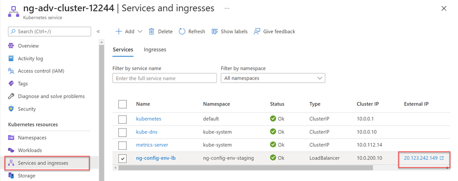

# Kubernetes

Use `arambazamba/ng-config-env`-image created earlier this module.

## Demos

- Kubernetes - Explain ng-config-env.yaml
- Use Kubernetes ConfigMap to inject config into Angular UI
- Deploy to Azure Kubernetes Services using Azure CLI Script `create-aks-cluster.sh`

ng-config-env.yaml:
```yaml
kind: ConfigMap 
apiVersion: v1 
metadata:
  name: ng-configmap 
data:
  ENV_API_URL: https://food-api-staging-4591.azurewebsites.net
---
apiVersion: apps/v1
kind: Deployment
metadata:
  name: ng-config-env
spec:
  replicas: 1
  selector:
    matchLabels:
      app: ng-config-env
  template:
    metadata:
      labels:
        app: ng-config-env                 
    spec:
      containers:
      - name: ng-config-env
        image: arambazamba/ng-config-env
        imagePullPolicy: Always
        envFrom:
        - configMapRef:
            name: ng-configmap
        ports:
        - containerPort: 80        
        resources:
          limits:            
            cpu: "500m"
            memory: "128Mi"
---
apiVersion: v1
kind: Service
metadata:
  name: ng-config-env-lb
spec:
  type: LoadBalancer
  ports:
  - port: 8081
    targetPort: 80
  selector:
    app: ng-config-env
---
```

Create the AKS cluster by executing `create-aks-cluster.azcli`



Browse the app on its external ip:

