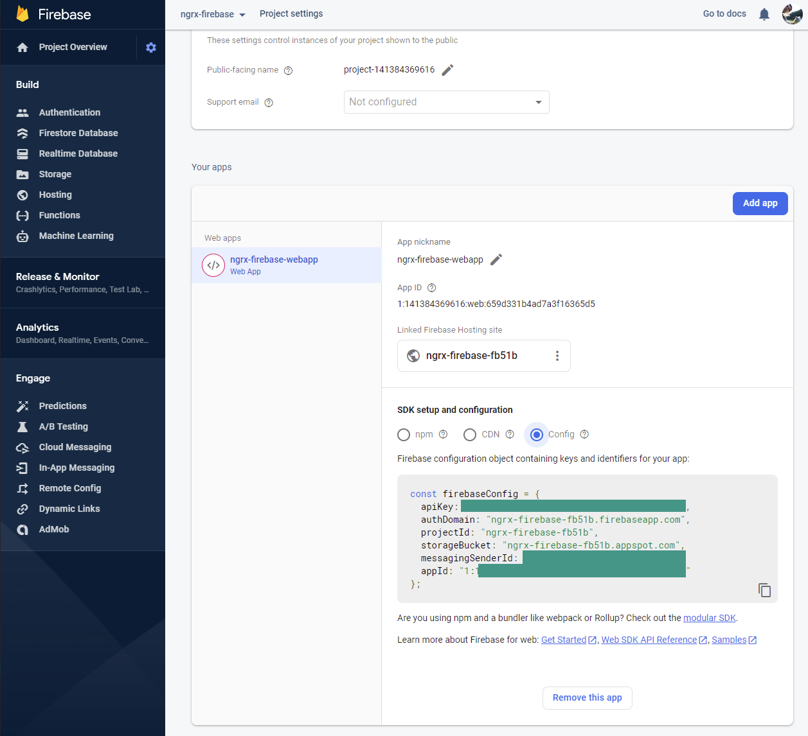

# Rounting & Security

## Routing and NgRx

Add Routing:

```
ng add @ngrx/router-store
```

```
npm install @ngrx/router-store --save
```

### Configuration

This effects changes in app.module.ts

Possible Settings:

```typescript
interface StoreRouterConfig {
  stateKey?: string | Selector<any, RouterReducerState<T>>;
  serializer?: new (...args: any[]) => RouterStateSerializer;
  navigationActionTiming?: NavigationActionTiming;
  routerState?: RouterState;
}
```

### Router State Serialization:

Setting to Full enables the DefaultRouterStateSerializer

```typescript
StoreRouterConnectingModule.forRoot({
  routerState: RouterState.Full,
});
```

Setting to Minimal enables the MinimalRouterStateSerialzer

```typescript
StoreRouterConnectingModule.forRoot({
  routerState: RouterState.Minimal,
});
```

REMARK: 
Dependent on Runtime Checks only the minimal Router Serializer can be used! The Full Router State will not be serializeable and therefore does not work with the Serializeability runtime checks!
An own serializer can be implemented.

Example for runtime checks
```typescript
    StoreModule.forRoot(reducers, {
      runtimeChecks: {
        strictStateImmutability: true,
        strictActionImmutability: true,
        strictStateSerializability: true,
        strictActionSerializability: true,
      },
      metaReducers
    })
```

### Navigate by Action - Effect

e.g there is a canLoad Guard:

```typescript
@Injectable({
  providedIn: 'root'
})
export class FBAuthGuard implements CanLoad {
  constructor(private store: Store<AuthState>) {}

  // this is a canLoad Guard - it does not prevent access after a logout
  canLoad(): boolean | Observable<boolean> | Promise<boolean> {
    return this.store.select(getUser).pipe(
      map(user => {
        if (user && user.email) {
        	return true
        } else {
          this.store.dispatch(new LoginRedirect());
          return false;
        }
      })
    );
  }
}
```

The LoginRedirect can be listened to in an effect:

```typescript
@Injectable()
export class AuthEffects {
  constructor(
  	private actions$: Actions, 
  	private as: AuthService, 
  	private router:Router) {}

  // Redirect to login page
  @Effect()
  loginRedirect$ = this.actions$.pipe(
    ofType(AuthActionTypes.LoginRedirect),
    pluck('payload'),
    exhaustMap(() => {
      this.router.navigate(['demos','login'])
      return EMPTY
    })

  );
```

This mechanism can be used to transfer the control over the viewed page completely to the state, instead of the UI and the router.
 
## Security using Firebase and NgRx

- Register Project at [Firebase](https://firebase.google.com/)
- Enable E-Mail SignIn
- Copy Firebase Config and add to `environment.ts`

    
