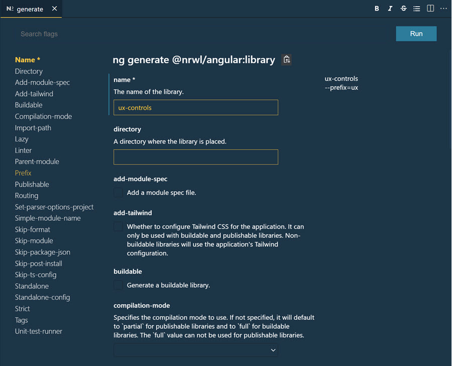
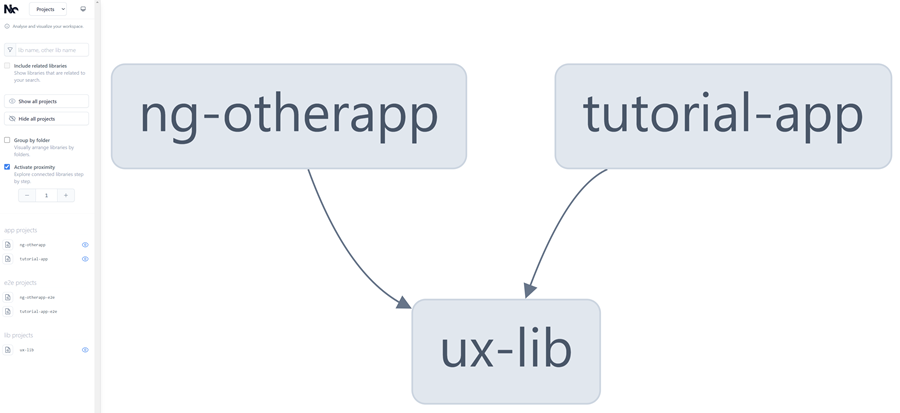

# Monorepos & nrwl nx

[Nx Home](https://nx.dev/angular)

[npx create-nx-workspace](https://nx.dev/nx/create-nx-workspace)

[Angular Nx Tutorial ](https://nx.dev/getting-started/angular-tutorial)

[Nx Console - VS Code Extension](https://marketplace.visualstudio.com/items?itemName=nrwl.angular-console)

## Getting Started

Create a workspace demo-app, add Angular:

```typescript
npx create-nx-workspace demo-app-ws --preset angular --appName demo-app
```

>Note: To spare yourself from executing nx-cli using npm you could also install nx-cli: `npm i -g create-nx-workspace` and `npm i -g nx`


Build the app `demo-app`:

```
ng build (using default app) |
ng build demo-app |
npx nx build demo-app
```

> Note: `npx nx builds demo-app` uses cache. It re-builds only when there are changes

Test the app using Jest (default)

```
npx nx test demo-app
```

Run the app:

```
npx nx s -o demo-app
```

## Button Implementation

Add a library project from the root of the nx workspace:

```typescript
npx nx g @nrwl/angular:lib ux-controls --buildable --publishable --importPath my-ux-controls
```

>Note: `@nrwl/angular:lib` contains the Angular extensions. Scaffolding can also be done using [Nx Console](https://marketplace.visualstudio.com/items?itemName=nrwl.angular-console)



Add a split component. Notice that Nx registeres the component in the module 

```typescript
nx g @nrwl/angular:component  ux-split --selector ux-split --export --project=ux-controls 
```

Add Angular Material & Angular FlexLayout to the workspace to use it in the `ux-controls` project:

```
npm i -S @angular/material @angular/cdk @angular/flex-layout
```

Import `MatToolbarModule` & `FlexLayoutModule` in `ux-controls.module.ts`:

```typescript
...
import { FlexLayoutModule } from '@angular/flex-layout';
import { MatToolbarModule } from '@angular/material/toolbar';
import { UxSplitComponent } from './ux-split/ux-split.component';

@NgModule({
  imports: [CommonModule, MatToolbarModule, FlexLayoutModule],
  declarations: [UxSplitComponent],
  exports: [UxSplitComponent],
})
export class UxControlsModule {}
```

Update `ux-split.component.html`:

```html
<div
  gdGap="0.5rem"
  gdAreas="title title | main toolbar"
  gdColumns="800px auto"
  gdRows="60px auto"
  class="container"
>
  <div gdArea="title" class="split-title">
    <mat-toolbar mat-dialog-title>
      <mat-toolbar-row>
        <ng-content select=".title"></ng-content>
      </mat-toolbar-row>
    </mat-toolbar>
  </div>
  <div gdArea="main" class="split-main">
    <ng-content select=".main"></ng-content>
  </div>
  <div gdArea="toolbar" class="split-sidebar">
    <ng-content select=".sidebar"></ng-content>
  </div>
</div>
```

Update `ux-split.component.scss`:

```css
.container {
  min-height: 50vh;
  height: 100%;
}

.split-main {
  padding: 1rem;
}

.split-sidebar {
  padding: 1rem;
}
```

Build the ux-controls project:

```
nx build ux-controls
```

Import the `UxControlsModule` in the `demoapp` project:

```typescript
import { UxControlsModule } from '../../../../libs/ux-controls/src/lib/ux-controls.module';

@NgModule({
  declarations: [AppComponent, NxWelcomeComponent],
  imports: [
    ...
    UxControlsModule
  ],
  providers: [],
  bootstrap: [AppComponent],
})
export class AppModule { }
```

Test your first component:

```
nx serve --project demoapp
```

Add a second app used for dependency graph later on:

```
nx generate @nrwl/angular:app ng-otherapp --routing --style=scss
```

Add Material to apps\demo-app:

```
nx g @angular/material:ng-add --project demoapp
```

Implement the Material Module in the lib

```
nx g module material --project=ux-controls
```

Implement an reusable Button - short guide - look up commands from ux-spilt example:

ux-button.ts & ux-button.html

```typescript
import { Component, OnInit, EventEmitter, Input, Output } from '@angular/core';

@Component({
  selector: 'ux-button',
  templateUrl: './ux-button.component.html',
  styleUrls: ['./ux-button.component.scss'],
})
export class UxButtonComponent implements OnInit {
  @Input() disabled = false;
  @Input() label = '';
  @Input() icon = '';
  @Output() onClick: EventEmitter<void> = new EventEmitter<void>();

  constructor() {}

  ngOnInit() {
    this.icon = '';
  }

  buttonClicked() {
    this.onClick.emit();
  }
}
```

```html
<button mat-raised-button (click)="buttonClicked()" [disabled]="disabled" color="primary">
  <mat-icon color="accent" fontIcon="bug_report"></mat-icon>
  <span fxHide.lt-md>{{ label }}</span>
</button>
```

Use the Button in the `demo-app-project`. Import `UxControlsModule` in `app.module.ts` :

```typescript
import { BrowserModule } from '@angular/platform-browser';
import { NgModule } from '@angular/core';

import { AppComponent } from './app.component';
import { BrowserAnimationsModule } from '@angular/platform-browser/animations';
import { UxControlsModule } from '@angular-repo/ux-controls';

@NgModule({
  declarations: [AppComponent],
  imports: [BrowserModule, BrowserAnimationsModule, UxControlsModule],
  providers: [],
  bootstrap: [AppComponent],
})
export class AppModule {}
```

Add it to `app.component.ts`:

```html
<div>
  <h3>{{title}}</h3>
  <ux-button
    [icon]="'bug_report'"
    [label]="'Report Bug'"
    (onClick)="doClick()"
  ></ux-button>
</div>
```

```typescript
import { Component } from '@angular/core';

@Component({
  selector: 'angular-repo-root',
  templateUrl: './app.component.html',
  styleUrls: ['./app.component.scss'],
})
export class AppComponent {
  title = 'demo-app';

  doClick() {
    console.log('you clicked');
  }
}
```

Test the Button:

```
npx nx s demo-app -o
```

Repate the steps in the second project in order to see a Dependency Graph where the button is used in two projects

```
nx dep-graph
```

You should see something similar:


