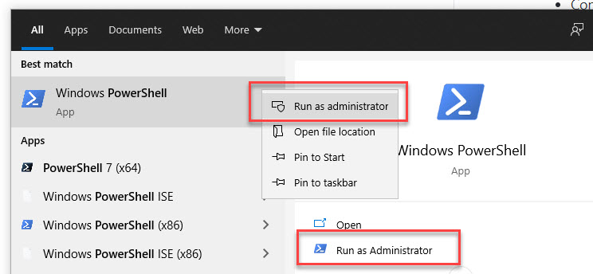
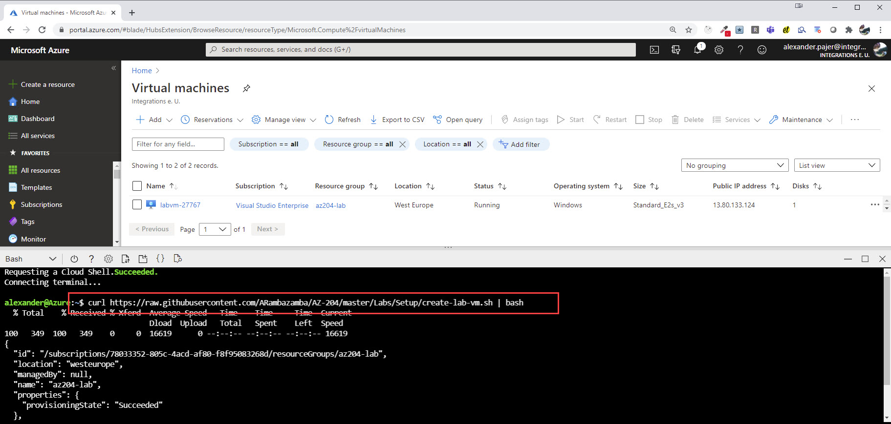
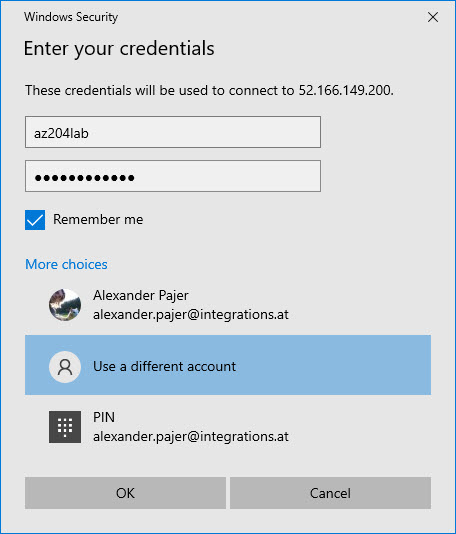

# Setup

- Install Software
- Install Windows Subsystem Linux - Optional
- Setup local container support - Optional
- Create Lab VM - Optional

## Install Software

To install Software run the script `setup-az-204.ps1` from an elevated PowerShell prompt:



```powershell
Set-ExecutionPolicy Bypass -Scope Process -Force;
Invoke-Expression ((New-Object System.Net.WebClient).DownloadString('https://raw.githubusercontent.com/arambazamba/ng-adv/main/setup/setup-angular-dev.ps1'))
```

> Note: This script will run for approx 15 min. No need to wait! In the meantime you can continue to fork and clone my repo as described in the next section.

Congratulations you have completed the base setup of your class software requirements.

## Install Windows Subsystem Linux - Optional

Requires Windows 10 - May 2020 Update or higher. To Update use this [link](https://www.microsoft.com/de-de/software-download/windows10).

[Install WSL 2](https://docs.microsoft.com/en-us/windows/wsl/install) in a Powershell Prompt:

```powershell
wsl --install
Restart-Computer
```

Finish installation of Ubuntu 20.04 LTS from the Microsoft Store:


### WSL Frameworks & Runtimes

[Introduction to Bash Scripting](https://www.taniarascia.com/how-to-create-and-use-bash-scripts/)

#### Node

Install Node 16.x on WSL

```bash
sudo apt update
sudo curl -sL https://deb.nodesource.com/setup_16.x | sudo bash
sudo apt-get install -y nodejs
```

#### .NET 6 

Register Packages:

```
wget https://packages.microsoft.com/config/ubuntu/20.10/packages-microsoft-prod.deb -O packages-microsoft-prod.deb
sudo dpkg -i packages-microsoft-prod.deb
```
Install .NET:

```
sudo apt-get update; \
sudo apt-get install -y apt-transport-https && \
sudo apt-get update && \
sudo apt-get install -y dotnet-sdk-6.0
```

#### Azure CLI

```
curl -sL https://aka.ms/InstallAzureCLIDeb | sudo bash
az config set extension.use_dynamic_install=yes
```

#### Azure Function Core Tools V4

```
sudo npm install -g azure-functions-core-tools@4 --unsafe-perm true
```

## Install Docker Support

This requires prev step - WSL Installation

Download & Install [Docker Desktop for Windows](https://desktop.docker.com/win/main/amd64/Docker%20Desktop%20Installer.exe?utm_source=docker&utm_medium=webreferral&utm_campaign=dd-smartbutton&utm_location=header) or execute:

```powershell
choco install docker-desktop -y
```

Double Click on Docker Desktop to start the installation. After installation you will be asked to log out and log in again.

Create an account at [Docker Hub](https://hub.docker.com/) and signin to Docker


Configure Cocker:


Enable Kubernetes:


Press Appy & Restart to complete Docker Setup

## Test Installation

In the console window execute:

```
docker run hello-world
```


## Create Lab VM - Optional

Execute `create-lab-vm.azcli` or run the following remote script in Cloud Shell

```bash
curl https://raw.githubusercontent.com/arambazamba/az-204/main/setup/create-lab-vm.azcli | bash
```



`create-lab-vm.azcli`:

```bash
rnd=$RANDOM
loc=westeurope
grp=az-lab
vmname=labvm-$rnd
user=azlabadmin
pwd=Lab@dmin1234

az group create -n $grp -l $loc

az vm create -g $grp -n $vmname --admin-username $user --admin-password $pwd --image MicrosoftWindowsDesktop:Windows-10:win10-21h2-pro-g2:latest --size Standard_E2s_v3 --public-ip-sku Standard
```

Connect to VM:

Go to Ressource Group `az-lab` and connect to VM using RDP and the credentials that you have used in the script:

Download RDP File:


Optional - Disable Login:


Sign In & Remember:


Credentials:

```
user=azlabadmin
pwd=Lab@dmin1234
```



Accept Settings:


